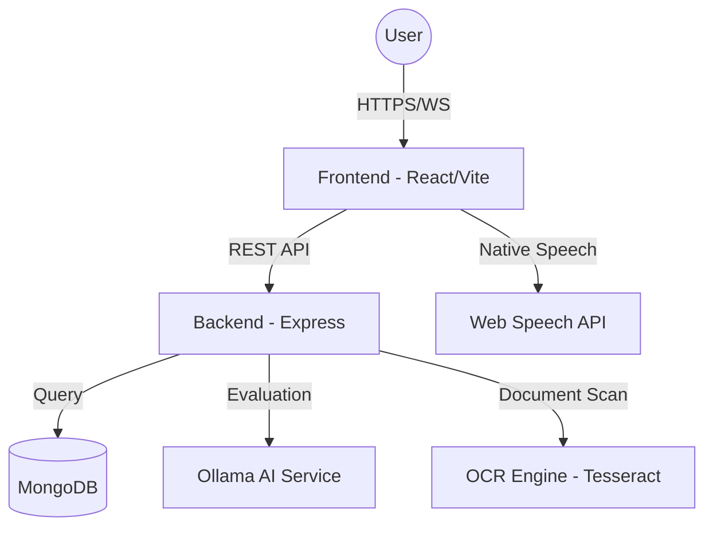

# <p align="center">🎓 GradSync</p>

<p align="center">
  <strong>Bridging the Gap Between Graduates and Employers with AI.</strong>
</p>

<p align="center">
  
  
  
  
  
</p>

---

## 🚀 Overview

**GradSync** is a premium, AI-powered career development ecosystem designed to streamline the transition from academic life to professional careers. By combining local AI intelligence with modern web technologies, GradSync provides a secure and efficient platform for automated skill verification, interactive mock interviews, and high-performance recruitment.

## ✨ Core Features

### 🛡️ Secure Verification
- **Automated Document OCR**: High-speed verification of Transcripts (TOR) and Business Permits using `Tesseract.js`.
- **Verified Badges**: Earn verifiable skill rankings (Entry to Expert) through standardized testing.

### 🤖 AI-Driven Preparation
- **Mock Interview Room**: Real-time evaluation of candidate responses using native Web STT/TTS and local Ollama models.
- **AI Career Mentor**: A 24/7 AI-powered coach offering personalized career guidance and preparation strategies.

### 💼 Professional Tools
- **Dynamic Resume Builder**: Professional PDF generation with automated summary crafting based on user skills and history.
- **Smart Matching**: AI-calculated job suitability scores to help graduates find their perfect career fit.

---

## 🛠️ Technology Stack

| Layer | Technologies |
| :--- | :--- |
| **Frontend** | React 19, Vite, Tailwind CSS, Framer Motion, GSAP, Lucide Icons |
| **Backend** | Node.js (Express), MongoDB (Mongoose), JWT, Socket.io |
| **AI/ML Engine** | Ollama (Local LLM), Tesseract.js (OCR), PDF-Parse |
| **Connectivity** | Web Speech API (STT/TTS), WebRTC (Live Preview) |

---

## 🏗️ System Architecture



---

## 🏁 Getting Started

### Prerequisites
- [Node.js](https://nodejs.org/) (v18+)
- [Ollama](https://ollama.com/) (Running with `qwen2.5:3b` or `llama3.1` model)
- [MongoDB](https://www.mongodb.com/) (Local or Atlas)

### 1. Backend Setup
```bash
cd backend
npm install
npm run dev
```

### 2. Frontend Setup
```bash
cd frontend/sipacareer
npm install
npm run dev
```

---

## 📄 License

This project is licensed under the MIT License - see the [LICENSE](LICENSE) file for details.

---

<p align="center">
  <i>Developed with expertise for the next generation of professionals.</i><br>
  <strong>BY MARK JOSEPH POTOT</strong>
</p>
