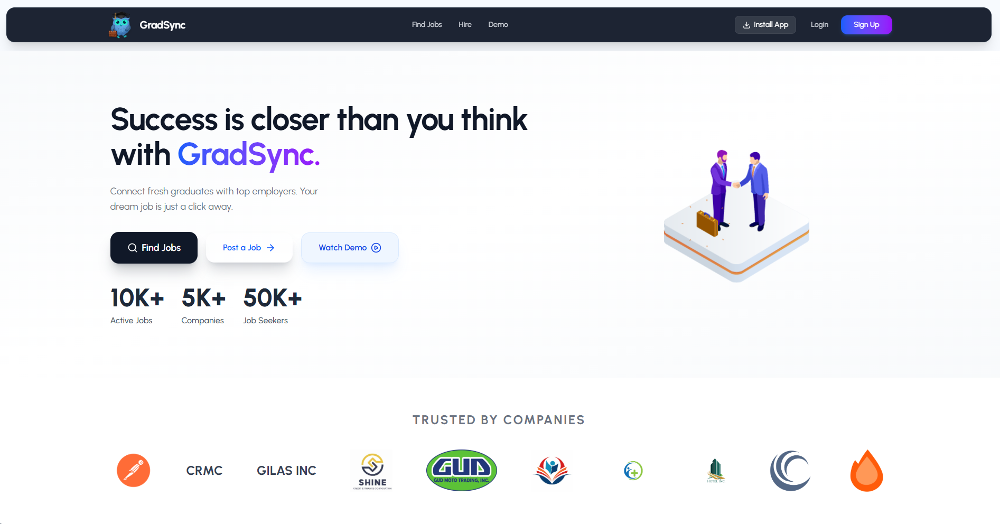

# <p align="center">🎓 GradSync</p>

<p align="center">
  
</p>

<p align="center">
  <strong>Your Intelligent Career Ecosystem — Powered by AI.</strong><br/>
  <em>Connecting talent with opportunity through automated skill verification, AI-driven interviews, smart job matching, and real-time collaboration — all in one seamless platform.</em>
</p>

<p align="center">
  
  
  
  
  
  
  
  
  
  
  
  
  
</p>


---

## 📋 Table of Contents

- [Overview](#-overview)
- [Key Features](#-key-features)
- [Tech Stack](#-tech-stack)
- [Project Structure](#-project-structure)
- [System Architecture](#-system-architecture)
- [Getting Started](#-getting-started)
- [Environment Variables](#-environment-variables)
- [API Routes](#-api-routes)
- [Deployment](#-deployment)
- [Contributing](#-contributing)
- [License](#-license)

---

## 🚀 Overview

**GradSync** is an all-in-one career platform that leverages dual AI engines — **local Ollama LLMs** for privacy-first processing and **Google Gemini AI** for advanced generation — to connect graduates with employers. The platform offers automated skill verification, interactive mock interviews, AI-driven job matching, real-time messaging, and a comprehensive admin dashboard.

### User Roles

| Role | Description |
| :--- | :--- |
| **Graduate / Jobseeker** | Browse jobs, apply with AI suitability scores, take skill assessments, practice mock interviews, build resumes, and chat with employers. |
| **Employer** | Post jobs, review AI-ranked applicants, manage contracts, analyze recruitment analytics, and communicate with candidates via real-time chat with auto-pilot. |
| **Admin** | Full control over users, jobs, applications, assessments, interviews, FAQs, terminations, AI feedbacks, and system-wide analytics. |


---

## ✨ Key Features

###  AI-Powered Job Matching
- **Dual AI Engine**: Ollama (local, private) and Google Gemini (cloud, advanced) for suitability scoring
- **Objective Scoring**: Skills (40 pts) + Experience (30 pts) + Education (30 pts) = 100-point scale
- **Match Levels**: Poor → Weak → Moderate → Good → Excellent
- **Personalized Feedback**: AI-generated analysis of candidate-job fit

###     Skill Assessments & Verification
- **Anti-Cheat Security System**:
  - Tab switch detection, window focus monitoring
  - Copy/paste & right-click prevention
  - DevTools shortcut blocking (F12, Ctrl+Shift+I/J/C)
  - Three-strike violation system with auto-submission
- **Admin Review Workflow**: Approve/reject submissions with violation log viewer
- **Verified Skill Badges**: Entry → Intermediate → Advanced → Expert rankings
- **PDF Certificates**: Auto-generated and emailed upon approval

###  AI Mock Interviews
- **Role-Based Interviews**: Pre-configured roles with custom question banks
- **Difficulty Levels**: Easy, Medium, Hard
- **Real-Time Evaluation**: AI scores each answer (0–100) with instant feedback
- **Full Interview Analysis**: Overall score, strengths, areas for improvement, and summary
- **Camera & Agreement Setup**: Professional pre-interview workflow

###  Smart Resume Builder
- **Professional PDF Templates**: Custom React-PDF components (pdfx)
- **AI-Generated Summaries**: Automated professional summary crafting from profile data
- **Skills & Experience Formatting**: Clean, ATS-friendly layouts

###  Real-Time Messaging
- **Socket.IO** with Redis Adapter for horizontal scaling
- **Web Push Notifications**: PWA push support for new messages
- **Content Moderation**: Automatic message filtering
- **Employer Auto-Pilot**: Automated reply system for common inquiries
###  Analytics & Insights
- **Employer Dashboard**: Application funnel, hire rates, retention metrics, AI-generated summaries
- **Admin Analytics**: Platform-wide metrics, user growth, job trends
- **In-Demand Skills Graph**: Visual skill gap analysis
- **Recharts-Powered Charts**: Interactive data visualizations

###  Contract & Termination Management
- **Employment Contracts**: Digital contract creation and tracking
- **Termination Reviews**: Structured termination reason tracking with admin oversight
- **Rating System**: Mutual employer-jobseeker rating with reviews

###  Notifications System
- **In-App Notifications**: Real-time notification dropdown
- **Email Notifications**: Verification, approval, rejection, interview results, password reset
- **Push Notifications**: Web Push API for PWA users

###  Admin Control Panel
- User management (create, edit, verify, suspend)
- Job & application oversight
- Assessment question bank & review
- Interview question & score management
- FAQ & employer settings management
- Feature feedback & AI resource center

###  Public Landing Page
- Hero section with animated Lottie graphics
- Feature showcases, How It Works flow
- Public job listings with search
- About, Contact, and Creators sections

### 📱 Progressive Web App (PWA)
- Offline support via service worker
- Installable on mobile/desktop
- Push notification support


---

## 🛠️ Tech Stack

### Frontend

| Category | Technologies |
| :--- | :--- |
| **Framework** | React 19, Vite 7 |
| **Language** | JavaScript (JSX) |
| **Styling** | Tailwind CSS 4 |
| **Routing** | React Router DOM 7 |
| **State Management** | React Context API, React Hook Form |
| **Animations** | Framer Motion, GSAP, Lottie (dotlottie-react) |
| **3D Graphics** | Three.js, @react-three/fiber, @react-three/drei |
| **Charts** | Recharts |
| **Maps** | Leaflet, React-Leaflet |
| **PDF** | @react-pdf/renderer, jsPDF, html2canvas |
| **Icons** | Lucide React |
| **HTTP Client** | Axios |
| **Real-Time** | Socket.IO Client |
| **Voice** | Web Speech API, Deepgram SDK |
| **Notifications** | react-hot-toast, canvas-confetti |
| **Data** | xlsx (export), date-fns, moment |
| **PWA** | vite-plugin-pwa, service worker |
| **Testing** | Vitest, Testing Library (React, Jest DOM, User Event) |


### Backend

| Category | Technologies |
| :--- | :--- |
| **Runtime** | Node.js 22 |
| **Framework** | Express 5 |
| **Language** | TypeScript 5 |
| **Database** | MongoDB, Mongoose 8 |
| **Authentication** | JWT, bcrypt, cookie-parser |
| **Real-Time** | Socket.IO 4, @socket.io/redis-adapter |
| **Job Queues** | BullMQ, ioredis (Redis) |
| **File Storage** | Cloudinary |
| **File Upload** | Multer 2 |
| **Email** | Nodemailer, Mailtrap |
| **Validation** | Zod |
| **Security** | Helmet, CORS, express-rate-limit |
| **Logging** | Morgan, Winston (w/ daily rotate) |
| **Scheduling** | node-cron |
| **Push Notifications** | web-push |
| **OCR** | Tesseract.js, pdf-parse |
| **PDF Generation** | PDFKit |

### AI / ML

| Category | Technologies |
| :--- | :--- |
| **Local LLM** | Ollama (via @langchain/ollama) |
| **Cloud LLM** | Google Gemini AI (via @langchain/google-genai) |
| **Orchestration** | LangChain Core, LangGraph |
| **STT / TTS** | Deepgram SDK |
| **OCR** | Tesseract.js |

### DevOps & Deployment

| Category | Technologies |
| :--- | :--- |
| **Hosting** | Heroku |
| **Database** | MongoDB Atlas |
| **Cache/Queue** | Redis (Upstash / Redis Cloud) |
| **File CDN** | Cloudinary |
| **CI/CD** | Git → Heroku auto-deploy |
| **Container** | Docker |


---

## 📁 Project Structure

```
Gradsync/
│
├── .vscode/                          # VS Code workspace settings
├── .idea/                            # JetBrains IDE settings
│
├── client/                           # ── React Frontend ──
│   ├── public/
│   │   ├── 3dgradsynnclogo.png       # 3D GradSync logo
│   │   ├── gradsynclogoapp.png       # App icon / favicon
│   │   ├── gradcoin.svg              # GradCoin token icon
│   │   └── service-worker.js         # PWA service worker
│   │
│   ├── src/
│   │   ├── assets/
│   │   │   ├── animations/           # Lottie JSON animations
│   │   │   │   ├── hiring-process.json
│   │   │   │   ├── jobportal.json
│   │   │   │   ├── login.json
│   │   │   │   ├── signup.json
│   │   │   │   ├── talking.json
│   │   │   │   └── welcomebirdie.json
│   │   │   └── images/               # Static images & avatars

│   │   │
│   │   ├── components/               # Shared / Reusable Components
│   │   │   ├── Badges/               # SkillBadges component
│   │   │   ├── Cards/                # JobCard component
│   │   │   ├── Input/                # InputField, SelectField, TextAreaField,
│   │   │   │                         #   LocationDetectInput, SalaryRangeSlider
│   │   │   ├── layout/               # DashboardLayout, ProfileDropdown,
│   │   │   │                         #   DashboardAreaChart, DashboardBarChart
│   │   │   ├── Map/                  # LocationMap, MapLocationInput
│   │   │   ├── pdfx/                 # Resume PDF components
│   │   │   │   ├── divider/
│   │   │   │   ├── heading/
│   │   │   │   ├── key-value/
│   │   │   │   ├── list/
│   │   │   │   ├── section/
│   │   │   │   └── text/
│   │   │   ├── ratings/              # EmployerRatingModal, JobseekerRatingModal,
│   │   │   │                         #   JobRatingBadge, ReviewsSection, StarRating,
│   │   │   │                         #   TerminateModal
│   │   │   ├── AnalyticsGate.jsx
│   │   │   ├── Breadcrumbs.jsx
│   │   │   ├── ChangePasswordModal.jsx
│   │   │   ├── FeatureFeedbackModal.jsx
│   │   │   ├── FormattedText.jsx
│   │   │   ├── InDemandSkillsGraph.jsx
│   │   │   ├── LoadingSpinner.jsx
│   │   │   ├── NotificationDropdown.jsx
│   │   │   ├── StatusBadge.jsx
│   │   │   └── TokenInfoModal.jsx
│   │   │
│   │   ├── context/
│   │   │   └── AuthContext.jsx        # Auth state, user role, token management
│   │   │
│   │   ├── lib/
│   │   │   └── pdfx-theme.ts          # Resume PDF theming configuration

│   │   │
│   │   ├── pages/
│   │   │   ├── LandingPage/           # Public landing page
│   │   │   │   ├── LandingPage.jsx
│   │   │   │   └── components/
│   │   │   │       ├── About.jsx
│   │   │   │       ├── CompanyShowcase.jsx
│   │   │   │       ├── Contact.jsx
│   │   │   │       ├── Creators.jsx
│   │   │   │       ├── Features.jsx
│   │   │   │       ├── Header.jsx
│   │   │   │       ├── Hero.jsx
│   │   │   │       ├── HeroCards.jsx
│   │   │   │       ├── HowItWorks.jsx
│   │   │   │       ├── PublicJobCard.jsx
│   │   │   │       └── PublicJobSection.jsx
│   │   │   │
│   │   │   ├── Auth/                  # Authentication pages
│   │   │   │   ├── Login.jsx
│   │   │   │   ├── SignUp.jsx
│   │   │   │   ├── ForgotPassword.jsx
│   │   │   │   ├── SetupProfileGrad.jsx
│   │   │   │   ├── SetupProfileJobseeker.jsx
│   │   │   │   └── components/
│   │   │   │       ├── ErrorModalLogin.jsx
│   │   │   │       ├── RegisterErrorModal.jsx
│   │   │   │       ├── RegisterSuccessModal.jsx
│   │   │   │       ├── NavigationButton.jsx
│   │   │   │       ├── ProfilePreview.jsx
│   │   │   │       ├── ProgressSteps.jsx
│   │   │   │       └── FormSteps/
│   │   │   │           ├── BasicInfoStep.jsx
│   │   │   │           ├── EducationStep.jsx
│   │   │   │           ├── ExperienceStep.jsx
│   │   │   │           ├── FormSteps.jsx
│   │   │   │           ├── JobPreferencesStep.jsx
│   │   │   │           ├── ProjectsStep.jsx
│   │   │   │           └── SkillsStep.jsx

│   │   │   │
│   │   │   ├── Graduates/Jobseeker/   # Jobseeker pages
│   │   │   │   ├── JobSeekerDashboard.jsx
│   │   │   │   ├── JobDetails.jsx
│   │   │   │   ├── SavedJobs.jsx
│   │   │   │   ├── UserProfile.jsx
│   │   │   │   ├── MyApplications.jsx
│   │   │   │   ├── CompanyProfileView.jsx
│   │   │   │   ├── ResumeBuilder.jsx
│   │   │   │   ├── ResumePDFx.jsx
│   │   │   │   ├── ConversationList.jsx
│   │   │   │   ├── Messages.jsx
│   │   │   │   └── components/
│   │   │   │       ├── FilterContent.jsx
│   │   │   │       ├── Navbar.jsx
│   │   │   │       ├── RecommendedJobs.jsx
│   │   │   │       ├── SearchHeader.jsx
│   │   │   │       ├── SuitabilityModal.jsx
│   │   │   │       ├── profile/
│   │   │   │       └── skeletons/

│   │   │   │
│   │   │   ├── Employer/              # Employer pages
│   │   │   │   ├── EmployerDashboard.jsx
│   │   │   │   ├── EmployerAnalytics.jsx
│   │   │   │   ├── JobPostingForm.jsx
│   │   │   │   ├── ManageJobs.jsx
│   │   │   │   ├── ApplicationViewer.jsx
│   │   │   │   ├── ApplicantProfile.jsx
│   │   │   │   ├── EmployerProfilePage.jsx
│   │   │   │   ├── EmployerMessages.jsx
│   │   │   │   ├── EmployerChatPanels.jsx
│   │   │   │   ├── EmployerChatWindow.jsx
│   │   │   │   ├── EmployerAutoPilot.jsx
│   │   │   │   ├── RankedCandidates.jsx
│   │   │   │   └── components/
│   │   │   │       ├── ApplicantProfilePreview.jsx
│   │   │   │       ├── ApplicationDashboardCard.jsx
│   │   │   │       ├── AvailabilityScheduler.jsx
│   │   │   │       ├── EmployerSuitabilityModal.jsx
│   │   │   │       ├── JobDashboardCard.jsx
│   │   │   │       ├── JobFAQManager.jsx
│   │   │   │       └── JobPostingPreview.jsx

│   │   │   │
│   │   │   ├── Admin/                 # Admin dashboard pages
│   │   │   │   ├── AdminDashboard.jsx
│   │   │   │   ├── AdminUsers.jsx
│   │   │   │   ├── AdminJobs.jsx
│   │   │   │   ├── AdminApplications.jsx
│   │   │   │   ├── AdminReports.jsx
│   │   │   │   ├── AdminFAQs.jsx
│   │   │   │   ├── AdminEmployerSettings.jsx
│   │   │   │   ├── AdminEmployerAnalytics.jsx
│   │   │   │   ├── AdminAssessmentManager.jsx
│   │   │   │   ├── AdminAssessmentReview.jsx
│   │   │   │   ├── AdminInterviewQuestions.jsx
│   │   │   │   ├── AdminInterviewScores.jsx
│   │   │   │   ├── AdminFeatureFeedbacks.jsx
│   │   │   │   ├── AdminAIResourceCenter.jsx
│   │   │   │   ├── AdminTerminations.jsx
│   │   │   │   └── components/
│   │   │   │       ├── AdminModal.jsx
│   │   │   │       └── UserForm/
│   │   │   │
│   │   │   ├── Assessment/            # Skill assessment pages
│   │   │   │   ├── AssessmentList.jsx
│   │   │   │   ├── AssessmentTaking.jsx
│   │   │   │   └── components/
│   │   │   │       ├── InstructionsScreen.jsx
│   │   │   │       ├── PreAssessmentAgreement.jsx
│   │   │   │       └── ViolationWarning.jsx
│   │   │   │
│   │   │   ├── Interview/             # Mock interview pages
│   │   │   │   ├── InterviewRoom.jsx
│   │   │   │   ├── InterviewResults.jsx
│   │   │   │   └── components/
│   │   │   │       ├── AgreementStep.jsx
│   │   │   │       ├── CameraSetupStep.jsx
│   │   │   │       ├── DifficultyCard.jsx
│   │   │   │       ├── EvaluatingScreen.jsx
│   │   │   │       ├── RulesStep.jsx
│   │   │   │       ├── SetupProgressBar.jsx
│   │   │   │       └── SuccessScreen.jsx
│   │   │   │
│   │   │   └── Documentation/         # Public documentation
│   │   │       └── Documentation.jsx
│   │   │
│   │   ├── routes/                    # Route guards
│   │   ├── App.jsx                    # Root component with all routes
│   │   ├── main.jsx                   # React entry point
│   │   └── index.css                  # Global styles (Tailwind)
│   │
│   ├── index.html                     # Vite HTML entry
│   ├── vite.config.js                 # Vite configuration
│   ├── eslint.config.js               # ESLint configuration
│   └── package.json                   # Client dependencies

│
├── server/                            # ── Express Backend ──
│   ├── src/
│   │   ├── config/
│   │   │   ├── db.ts                  # MongoDB connection
│   │   │   └── environment.ts         # Environment variables validation
│   │   │
│   │   ├── controllers/               # Route handlers / business logic
│   │   │   ├── admin.controller.ts
│   │   │   ├── ai.controller.ts
│   │   │   ├── analytics.controller.ts
│   │   │   ├── application.controller.ts
│   │   │   ├── assessment.controller.ts
│   │   │   ├── auth.controller.ts
│   │   │   ├── contract.controller.ts
│   │   │   ├── conversation.controller.ts
│   │   │   ├── employer.controller.ts
│   │   │   ├── generation.controller.ts
│   │   │   ├── interview.controller.ts
│   │   │   ├── job.controller.ts
│   │   │   ├── message.controller.ts
│   │   │   ├── notification.controller.ts
│   │   │   ├── payment.controller.ts
│   │   │   ├── saved-jobs.controller.ts
│   │   │   ├── termination-review.controller.ts
│   │   │   └── user.controller.ts
│   │   │
│   │   ├── models/                    # Mongoose schemas
│   │   │   ├── Application.model.ts
│   │   │   ├── Assessment.model.ts
│   │   │   ├── AssessmentSubmission.model.ts
│   │   │   ├── Contract.model.ts
│   │   │   ├── Conversation.model.ts
│   │   │   ├── EmployerSettings.model.ts
│   │   │   ├── FAQ.model.ts
│   │   │   ├── FeatureFeedback.model.ts
│   │   │   ├── Interview.model.ts
│   │   │   ├── InterviewDraft.model.ts
│   │   │   ├── InterviewQuestion.model.ts
│   │   │   ├── InterviewRole.model.ts
│   │   │   ├── Job.model.ts
│   │   │   ├── JobFAQ.model.ts
│   │   │   ├── Message.model.ts
│   │   │   ├── Otp.model.ts
│   │   │   ├── SavedJob.model.ts
│   │   │   ├── SystemMetrics.model.ts
│   │   │   ├── SystemSettings.model.ts
│   │   │   ├── TerminationReason.model.ts
│   │   │   ├── TerminationReview.model.ts
│   │   │   └── User.model.ts

│   │   │
│   │   ├── routes/                    # Express route definitions
│   │   │   ├── admin.route.ts
│   │   │   ├── ai.route.ts
│   │   │   ├── analytics.route.ts
│   │   │   ├── application.route.ts
│   │   │   ├── assessment.route.ts
│   │   │   ├── auth.route.ts
│   │   │   ├── contract.route.ts
│   │   │   ├── conversation.route.ts
│   │   │   ├── employer.route.ts
│   │   │   ├── generation.route.ts
│   │   │   ├── interview.route.ts
│   │   │   ├── interview-question.route.ts
│   │   │   ├── interview-role.route.ts
│   │   │   ├── job.route.ts
│   │   │   ├── message.route.ts
│   │   │   ├── notification.route.ts
│   │   │   ├── payment.route.ts
│   │   │   ├── saved-jobs.route.ts
│   │   │   ├── termination-review.route.ts
│   │   │   └── user.route.ts
│   │   │
│   │   ├── middlewares/
│   │   │   ├── auth.middleware.ts      # JWT authentication
│   │   │   ├── errorHandler.ts         # Global error handler
│   │   │   ├── notFound.ts             # 404 handler
│   │   │   ├── upload.middleware.ts     # Multer configuration
│   │   │   └── validator.ts            # Zod validation middleware
│   │   │
│   │   ├── services/
│   │   │   ├── ai/
│   │   │   │   ├── ollama.service.ts           # Ollama local LLM (LangChain)
│   │   │   │   ├── gemini.service.ts            # Google Gemini AI (LangChain)
│   │   │   │   ├── ai-limit.service.ts          # Rate limiting for AI requests
│   │   │   │   └── workflows/
│   │   │   │       └── interview-agent.workflow.ts  # LangGraph interview flow
│   │   │   ├── cloudinary.service.ts            # Image/document uploads
│   │   │   ├── socket.service.ts                # Socket.IO with Redis Adapter
│   │   │   ├── queue.service.ts                 # BullMQ job queue
│   │   │   ├── generation.service.ts            # AI generation helpers
│   │   │   └── auto-reply.helper.ts             # Employer auto-pilot replies

│   │   │
│   │   ├── templates/                 # Email templates
│   │   │   └── email/
│   │   │       ├── approval.template.ts
│   │   │       ├── assessment-approval.template.ts
│   │   │       ├── assessment-rejection.template.ts
│   │   │       ├── forgot-password.template.ts
│   │   │       ├── index.ts
│   │   │       ├── interview-result.template.ts
│   │   │       ├── rejection.template.ts
│   │   │       ├── verification-failed.template.ts
│   │   │       └── verification-success.template.ts
│   │   │
│   │   ├── utils/
│   │   │   ├── assessment-certificate.ts   # PDF certificate generation
│   │   │   ├── email.service.ts            # Nodemailer + Mailtrap
│   │   │   ├── generateToken.ts            # JWT helpers
│   │   │   ├── notification.helper.ts      # In-app + Push notifications
│   │   │   └── ocr.service.ts              # Tesseract.js OCR processing
│   │   │
│   │   ├── validations/               # Zod schemas
│   │   ├── interfaces/                # TypeScript interfaces
│   │   │   ├── ai.interfaces.ts
│   │   │   └── base.interfaces.ts
│   │   ├── errors/                    # Custom error classes
│   │   ├── jobs/                      # Cron jobs
│   │   │   └── cron.ts
│   │   ├── seeds/                     # Database seeders
│   │   ├── scripts/                   # Utility scripts
│   │   ├── server.ts                  # HTTP + Socket.IO server entry
│   │   ├── worker.ts                  # BullMQ worker (heavy tasks)
│   │   ├── scheduler.ts               # Heroku scheduler (cleanup)
│   │   └── app.ts                     # Express app configuration
│   │
│   ├── tsconfig.json                  # TypeScript configuration
│   └── package.json                   # Server dependencies
│
├── .gitignore
├── package.json                       # Root package (Heroku deployment)
├── README.md                          # 📄 You are here
├── ASSESSMENT_SECURITY_IMPLEMENTATION.md  # Security system docs
└── LICENSE
```


---

## 🏗️ System Architecture


```mermaid
flowchart TD

subgraph group_client["🖥️ React Client (Vite)"]
    node_landing["🏠 Landing Page<br/>Public UI"]
    node_auth["🔐 Auth Flows<br/>Login / SignUp / ForgotPwd"]
    node_jobseeker["👨‍🎓 Jobseeker UI<br/>Dashboard · Jobs · Resume · Chat"]
    node_employer["🏢 Employer UI<br/>Dashboard · Post Jobs · Analytics · Chat"]
    node_admin["🛡️ Admin UI<br/>Users · Jobs · Assessments · Interviews"]
    node_assessment_ui["📝 Assessment Workflow<br/>Anti-Cheat · Taking · Results"]
    node_interview_ui["🎤 Interview Workflow<br/>Camera · AI Eval · Results"]
    node_client_state(("🔐 AuthContext<br/>Routes / Guards"))
end

subgraph group_server["⚡ Express API Server"]
    node_api_routes["🌐 HTTP Routes<br/>20+ route modules"]
    node_controllers["🎮 Controllers<br/>Business logic"]
    node_models[("💾 Mongo Models<br/>22+ schemas")]
    node_middlewares["🛡️ Middleware<br/>Auth · CORS · RateLimit · Validation"]
    node_services["🔧 Services<br/>Integrations"]
end

subgraph group_infra["☁️ Infrastructure"]
    node_ai_workflow["🧠 AI Engine<br/>Ollama (Local LLM)<br/>Gemini (Cloud LLM)<br/>LangChain + LangGraph"]
    node_ocr["📄 OCR<br/>Tesseract.js<br/>PDF Parse"]
    node_realtime["📡 Real-Time<br/>Socket.IO<br/>Redis Adapter"]
    node_storage["🖼️ Storage<br/>Cloudinary CDN"]
    node_email["📧 Email<br/>Nodemailer<br/>Mailtrap"]
    node_db[("🗄️ MongoDB Atlas")]
    node_redis[("⚡ Redis<br/>Cache + Queues")]
    node_worker["🔨 BullMQ Worker<br/>AI · OCR jobs"]
    node_push["🔔 Web Push<br/>PWA Notifications"]
end

group_client --> group_server
group_server --> group_infra

classDef toneBlue fill:#dbeafe,stroke:#2563eb,stroke-width:1.5px,color:#172554
classDef toneAmber fill:#fef3c7,stroke:#d97706,stroke-width:1.5px,color:#78350f
classDef toneMint fill:#dcfce7,stroke:#16a34a,stroke-width:1.5px,color:#14532d

class node_landing,node_auth,node_jobseeker,node_employer,node_admin,node_assessment_ui,node_interview_ui,node_client_state toneBlue
class node_api_routes,node_controllers,node_models,node_middlewares,node_services toneAmber
class node_ai_workflow,node_ocr,node_realtime,node_storage,node_email,node_db,node_redis,node_worker,node_push toneMint
```


---

## 🏁 Getting Started

### Prerequisites

| Tool | Version | Purpose |
| :--- | :--- | :--- |
| [Node.js](https://nodejs.org/) | **22.x** | JavaScript runtime |
| [MongoDB](https://www.mongodb.com/) | 8.x | Primary database (Atlas or local) |
| [Redis](https://redis.io/) | 7.x | Cache & job queues (optional for dev) |
| [Ollama](https://ollama.com/) | Latest | Local AI engine (pull `qwen2.5:3b` or `llama3.1`) |
| [Git](https://git-scm.com/) | Latest | Version control |

### 1. Clone & Install

```bash
# Clone the repository
git clone https://github.com/Mark20042/SipaCareer.git
cd SipaCareer

# Install server dependencies
cd server
npm install

# Install client dependencies
cd ../client
npm install
```

### 2. Environment Variables

Create a `.env` file in the `server/` directory. See [Environment Variables](#-environment-variables) below for all required keys.

### 3. Start Ollama (Local AI)

```bash
# Pull a model (choose one)
ollama pull qwen2.5:3b
# or
ollama pull llama3.1

# Start the Ollama server
ollama serve
```

### 4. Start Redis (optional, for queues)

```bash
# Using Docker
docker run -d --name redis -p 6379:6379 redis:7-alpine
```

### 5. Run the Application

```bash
# Terminal 1 — Start the backend
cd server
npm run dev

# Terminal 2 — Start the worker (optional, for background jobs)
npm run dev:worker

# Terminal 3 — Start the frontend
cd client
npm run dev
```

The app will be running at:
- **Frontend**: `http://localhost:5173`
- **Backend API**: `http://localhost:5000`
- **Health Check**: `http://localhost:5000/health`


---

## 🔧 Environment Variables

Create a `.env` file in `server/` with the following variables:

```env
# ── Server ──
PORT=5000
NODE_ENV=development
FRONTEND_URL=http://localhost:5173
CORS_ORIGINS=http://localhost:5173

# ── MongoDB ──
MONGODB_URI=mongodb+srv://<user>:<pass>@cluster.mongodb.net/gradsync

# ── JWT ──
JWT_SECRET=your_jwt_secret_key
JWT_LIFETIME=7d
JWT_REFRESH_LIFETIME=30d

# ── Ollama (Local AI) ──
OLLAMA_BASE_URL=http://localhost:11434
OLLAMA_MODEL=qwen2.5:3b

# ── Gemini (Cloud AI) ──
GEMINI_API_KEY=your_gemini_api_key

# ── Redis ──
REDIS_URL=redis://localhost:6379
# or for Upstash:
# REDIS_URL=rediss://default:<token>@host.upstash.io:6379

# ── Cloudinary ──
CLOUDINARY_CLOUD_NAME=your_cloud_name
CLOUDINARY_API_KEY=your_api_key
CLOUDINARY_API_SECRET=your_api_secret

# ── Email (Gmail) ──
EMAIL_SERVICE=gmail
EMAIL_USER=your_email@gmail.com
EMAIL_PASSWORD=your_app_password
EMAIL_FROM="GradSync <noreply@gradsync.tech>"

# ── Email (Mailtrap - Development) ──
MAILTRAP_TOKEN=your_mailtrap_token
MAILTRAP_INBOX_ID=your_inbox_id

# ── Web Push (PWA) ──
VAPID_PUBLIC_KEY=your_vapid_public_key
VAPID_PRIVATE_KEY=your_vapid_private_key
```


---

## 📡 API Routes

### Authentication
| Method | Endpoint | Description |
| :--- | :--- | :--- |
| POST | `/api/auth/signup` | Register a new user |
| POST | `/api/auth/login` | Login & receive JWT |
| POST | `/api/auth/forgot-password` | Send OTP for password reset |
| POST | `/api/auth/reset-password` | Reset password with OTP |
| POST | `/api/auth/logout` | Logout & clear cookie |

### Users
| Method | Endpoint | Description |
| :--- | :--- | :--- |
| GET | `/api/users/me` | Get current user profile |
| PUT | `/api/users/me` | Update current user profile |
| GET | `/api/users/:id` | Get user by ID |

### Jobs
| Method | Endpoint | Description |
| :--- | :--- | :--- |
| GET | `/api/jobs` | List all jobs (with filters) |
| GET | `/api/jobs/:id` | Get job details |
| POST | `/api/jobs` | Create a job (employer) |
| PUT | `/api/jobs/:id` | Update a job (employer) |
| DELETE | `/api/jobs/:id` | Delete a job (employer) |

### Applications
| Method | Endpoint | Description |
| :--- | :--- | :--- |
| POST | `/api/applications` | Apply to a job |
| GET | `/api/applications` | Get user's applications |
| GET | `/api/applications/job/:id` | Get applicants for a job |
| PUT | `/api/applications/:id/status` | Update application status |

### AI
| Method | Endpoint | Description |
| :--- | :--- | :--- |
| POST | `/api/ai/suitability` | Get job suitability score |
| POST | `/api/ai/summary` | Generate resume summary |
| POST | `/api/ai/interview-eval` | Evaluate interview answer |
| POST | `/api/ai/full-interview-eval` | Full interview evaluation |
| POST | `/api/ai/skill-gaps` | Analyze skill gaps (employer) |

### Assessments
| Method | Endpoint | Description |
| :--- | :--- | :--- |
| GET | `/api/assessments` | List available assessments |
| GET | `/api/assessments/:id` | Get assessment details |
| POST | `/api/assessments/submit` | Submit assessment answers |
| GET | `/api/assessments/submissions` | Get submissions (admin) |
| PUT | `/api/assessments/submissions/:id/approve` | Approve submission |
| PUT | `/api/assessments/submissions/:id/reject` | Reject submission |

### Interviews
| Method | Endpoint | Description |
| :--- | :--- | :--- |
| GET | `/api/interviews/roles` | List interview roles |
| POST | `/api/interviews/start` | Start an interview session |
| POST | `/api/interviews/evaluate` | Evaluate a single answer |
| POST | `/api/interviews/complete` | Complete & get final results |

### Messages
| Method | Endpoint | Description |
| :--- | :--- | :--- |
| GET | `/api/conversations` | List user conversations |
| POST | `/api/conversations` | Create a conversation |
| GET | `/api/messages/:conversationId` | Get conversation messages |


---

## 🚢 Deployment

### Heroku Deployment

The project is configured for Heroku deployment:

```bash
# Install Heroku CLI & login
heroku login

# Create & configure the app
heroku create gradsync-api
heroku config:set MONGODB_URI="your_mongodb_uri"
heroku config:set JWT_SECRET="your_jwt_secret"
heroku config:set GEMINI_API_KEY="your_gemini_key"
# ... set all required env vars

# Deploy
git push heroku main
```

The `heroku-postbuild` script in the root `package.json` automatically:
1. Installs server dependencies (with `--legacy-peer-deps`)
2. Compiles TypeScript (`tsc`)
3. Resolves TypeScript path aliases (`tsc-alias`)

### Docker

```bash
# Build
docker build -t gradsync-server -f server/Dockerfile ./server

# Run
docker run -p 5000:5000 --env-file server/.env gradsync-server
```

---

## 🤝 Contributing

Contributions, issues, and feature requests are welcome! Feel free to check the [issues page](https://github.com/Mark20042/SipaCareer/issues).

1. Fork the repository
2. Create your feature branch (`git checkout -b feature/AmazingFeature`)
3. Commit your changes (`git commit -m 'Add some AmazingFeature'`)
4. Push to the branch (`git push origin feature/AmazingFeature`)
5. Open a Pull Request

---

## 📄 License

This project is licensed under the MIT License - see the [LICENSE](LICENSE) file for details.

---

<p align="center">
  <i>Developed with expertise for the next generation of professionals.</i><br/>
  <strong>BY MARK JOSEPH POTOT</strong>
</p>

<p align="center">
  <sub>Last updated: July 2026 · <a href="https://github.com/Mark20042/SipaCareer">GitHub Repository</a></sub>
</p>

